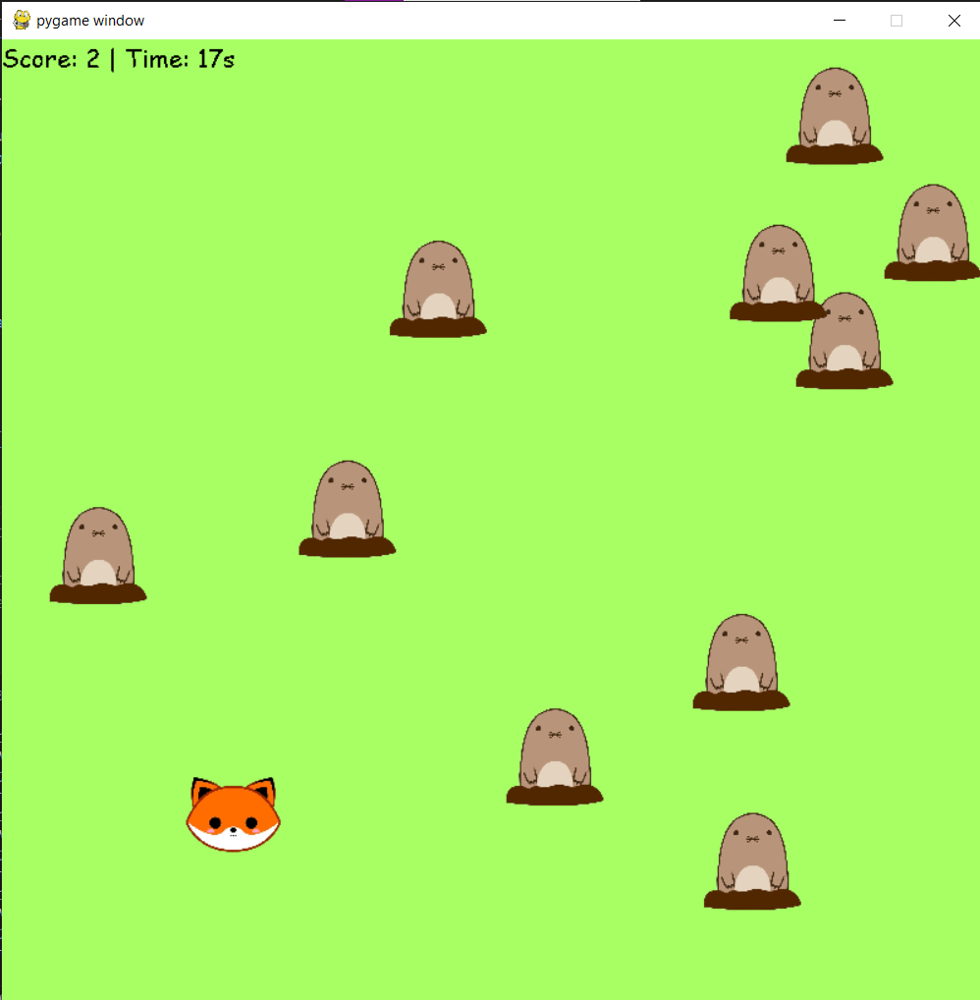
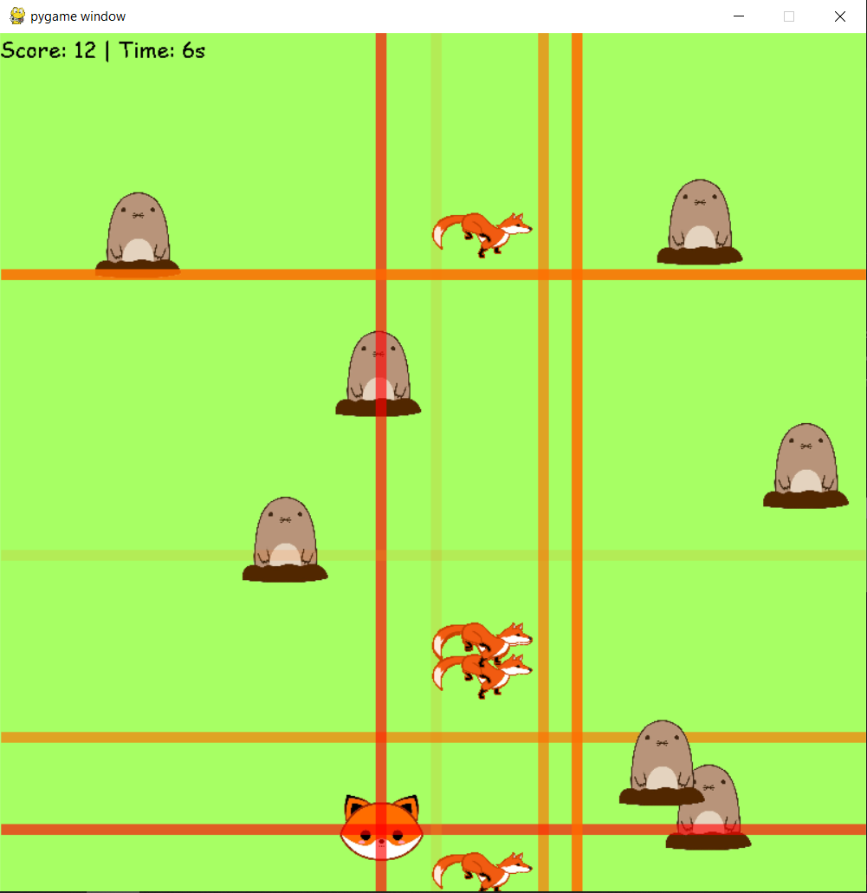
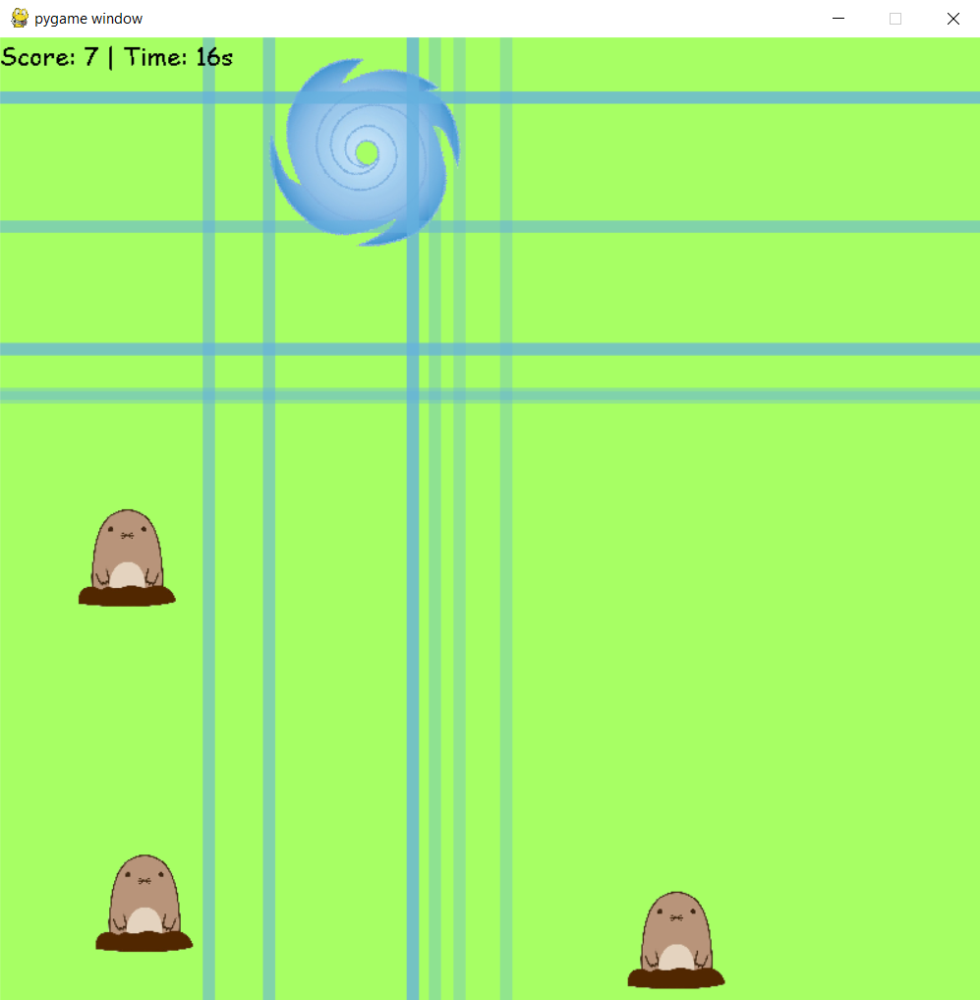

# Whack a mole (on steroids)
This is whack a mole with additional powerups I made for my CS50 final project.

## Play the game
1. Clone the repo
```
git clone https://github.com/tovicheung/whack-a-mole
```

2. Run `main.py`
```
python3 main.py
```

## How to play?
You have 30 seconds to move your mouse and click on the moles to WHACK them and gain points. The moles will disappear after 3 seconds after spawning so you gotta be quick!

## Power-Ups
The power-ups are fun (and somewhat silly lol) and they help you get more points.
#### Hourglass
The hourglass gives you an extra 5 seconds.
#### Fox
Clicking on the fox power-up will summon 5 foxes that run across the screen to eat the moles and get more points.
#### Wind
It will summon a hurricane that follows the cursor for 3 seconds. The hurricane will blow away the moles and get more points for you. It will do its thing on its own, you don't need to click, just move the cursor around!

## Screenshots
Power-up spawned (fox)

Foxes in action!

Wind in action!

